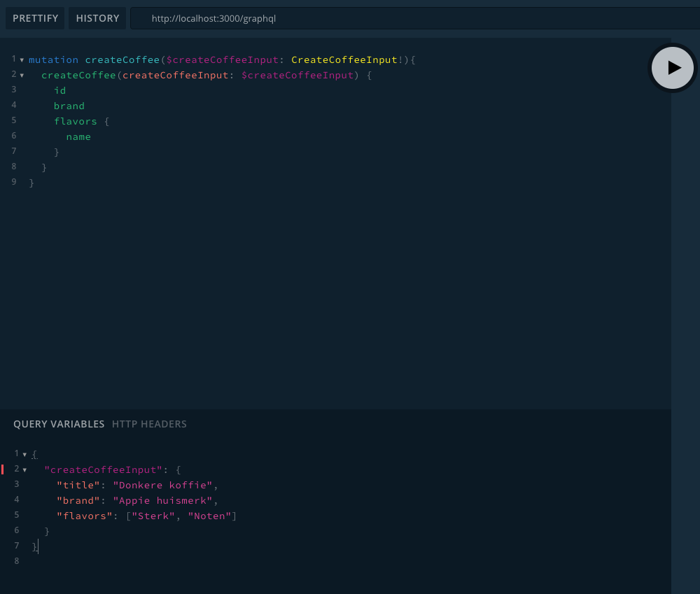

# NestJS REST & GraphQL example

Dit project is een uitwerking van de officiele NestJS course die [hier](https://courses.nestjs.com/) is terug te vinden.
Daarnaast is er ook een GraphQL implementatie uitgewerkt. Het doel van deze course was om een backend 
te bouwen met de technieken in de onderstaande tabel. Daarnaast laat het project ook het verschil zien tussen een REST en een GraphQL API.
Een evaluatie over GraphQL, REST en NestJS is [hier](./docs/NestJS_evaluatie.pdf) terug te vinden.

| Technieksoort  | Naam
| -------------- | ---------
| Runtime        | [NodeJS](https://nodejs.org/en/)
| Programmeertaal| [TypeScript](https://www.typescriptlang.org/)
| Framework      | [NestJS](https://nestjs.com/)    
| API(s)         | [GraphQL](https://graphql.org/) / [REST](https://en.wikipedia.org/wiki/Representational_state_transfer)
| Databasemethoden | [MongoDB](https://www.mongodb.com/) / [PostgreSQL](https://www.postgresql.org/)
| Documentatie   | [Swagger](https://swagger.io/) (voor de rest API)
| Testtools    | [Jest](https://jestjs.io/)

Om dit project werkend te krijgen is een installatie van [Docker (Compose)](https://docs.docker.com/compose/install/) en
[NodeJS](https://nodejs.org/en/download/) vereist.


## Inhoud

#### iluvcoffee: REST API met TypeORM + PostgreSQL koppeling (bevat ook de onderstaande onderdelen die zijn behandeld in de course);


- (Validation)pipes;
- Middleware;
- Filters;
- Guards;
- Interceptors;
- Decorators;
- Unittests;
- Migrations;
- Events.


#### iluvcoffee-mongoose: REST API met TypeORM + MongoDB koppeling;


#### iluvcoffee-graphql: Eigen prototype van een GraphQL API met TypeORM + PostgreSQL koppeling.


## Project setup
1. Clone deze repository;
2. Open de folder van het project dat je wil openen;
3. Run `npm install` in de root van de folder;
4. Run `cp .env.dist .env`;
5. Run `docker-compose up -d`.

## Running the app

```bash
# development
$ npm run start

# watch mode
$ npm run start:dev

# production mode
$ npm run start:prod
```

## Test

```bash
# unit tests
$ npm run test

# e2e tests
$ npm run test:e2e

# test coverage
$ npm run test:cov
```

## REST API Documentatie

Zie http://localhost:3000/api voor de swagger documentatie (alleen beschikbaar in iluvcoffee).

Gebruik de API_KEY in de .env als authenticatie header in de API requests. (alleen nodig voor iluvcoffee)

## GraphQL API documentatie

Open de GraphQL playground op http://localhost:3000/graphql

Documentatie/schemas zijn terug te vinden in de tab rechts onder "docs" en "schemas".
Hierin zijn de beschikbare models terug te vinden.

Zie de afbeelding hieronder voor een voorbeeld hoe mutaties en queries uitgevoerd worden in GraphQL. Let op: query
variables zijn alleen nodig voor mutaties, dus niet voor queries!



Hieronder zijn een aantal voorbeeld queries terug te vinden. De resolver is terug te vinden in de src/coffees/coffees.resolver.ts

### Voorbeeld queries

#### updateCoffee

```
mutation {
  updateCoffee(coffeeId: "1", updateCoffeeInput: {
    title: "Dark roast"
    recommendations: "0"
  }){
    title
    brand
    recommendations
    flavors {
      name
    }
  }
}
```

#### createCoffee
Query:
```
mutation createCoffee($createCoffeeInput: CreateCoffeeInput!){
  createCoffee(createCoffeeInput: $createCoffeeInput) {
    id
    brand
    flavors {
      name
    }
  }
}
```
Variabelen:
```
{
  "createCoffeeInput": {
    "title": "Donkere koffie",
    "brand": "Appie huismerk",
    "flavors": ["Sterk", "Noten"]
  }
}
```

#### recommendCoffee
```
mutation {
  recommendCoffee(coffeeId: "1" ){
    id
    recommendations
    flavors {
      name
    }
  }
}
```

#### coffee (query)
```
query {
  coffee(id: "1"){
    id
    title
    description
    brand
    recommendations
    flavors {
      name
    }
  }
}
```
